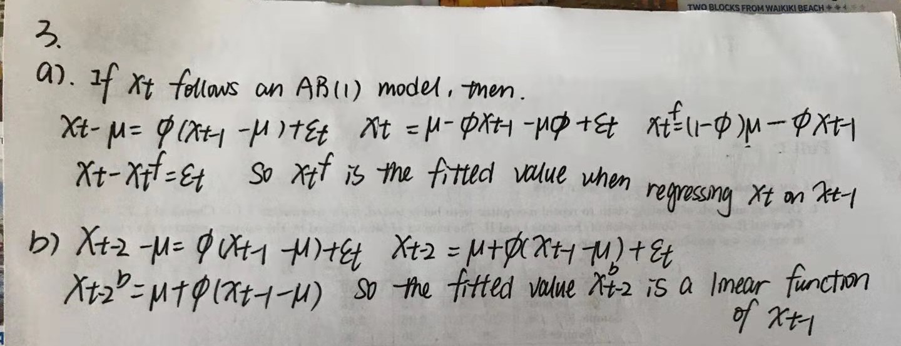
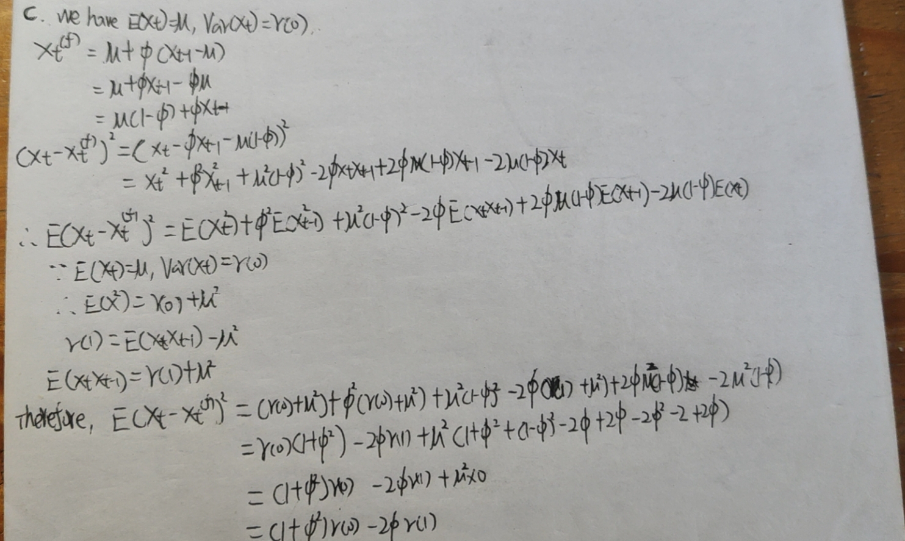
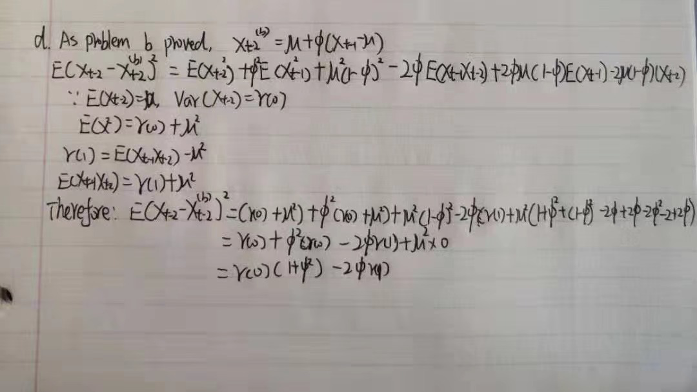
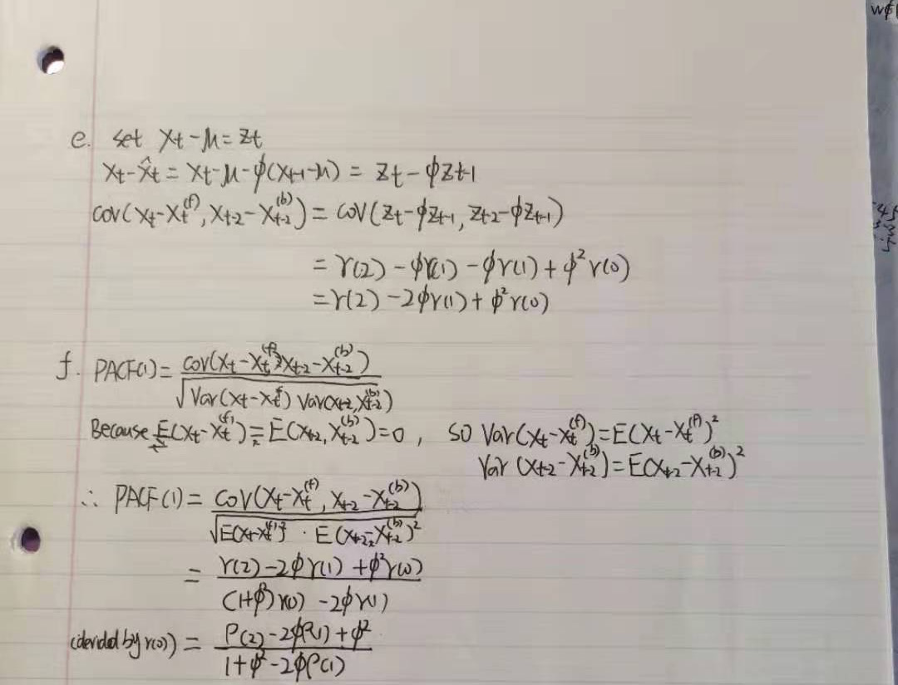

```{r setup, include=FALSE}
knitr::opts_chunk$set(echo = TRUE)
```

1a
```{r}
data <- read.csv("C:/Users/Administrator/Desktop/sta137/GlobTempNASA_2020.csv")
newdata=data[-c(1,2,3,4),]
y<-newdata$December
tm<-newdata$Global.Land.and.Ocean.Temperature.Anomalies
trnd <- loess(y ~ tm, span = 0.3)
plot(tm, y, type = "l", lty = 1, xlab = "Time", ylab = "Year", main = "Global Land and Ocean Temperature Anomalies")
points(tm, trnd$fitted,type = "l", lty = 2, col = "blue") 
legend("topleft", "loess", lty = 2, col = "blue")
```
1b
```{r}
rough = trnd$residuals 
plot(rough, type = "l", xlab = "Time", ylab = "Residuals", main = "Rough part")
#The rough part of the trend is symmetrically distributed
```

1c.

In the acf plot, there five p(j) outside the bound, which show that this model is fairly fit to the data.
```{r}
acf(rough)
#From the acf graph, there are six significance in the model
pacf(rough,main="PACF")
#From the pacf graph, there are five significance in the model,which mean we should use the ar(1) model
```
1d
We see AR(6) gives the lowest BIC and lowest number of parameters.
```{r}
aic_table=rep(0,6) 
for (i in 0:5){##you can check for higher orders
   aic_table[i+1]=arima(rough,order=c(i,0,0))$aic
} 
aic_table
```
1e
##Does this plot suggest that the model selected in part (d) a reasonable one?
Yes, from the plot the autocorrelation values between each other is small,therefore it suggested the AR(5) model is accurate

##Also carry out the Ljung-Box test on the residuals at level a = 0:05. Summarize your findings.
p-value is larger than alpha level, so we cannot reject Ho. 
```{r}
mod_ar5 <- arima(rough,order=c(5,0,0)) 
mod_ar5$coef
mod_ar5$var.coef##variance covariance matrix, so select diagonals to get variance
sqrt(diag(mod_ar5$var.coef))##std.error = sqrt(variance)
acf(mod_ar5$residuals,main="ACF plot for residuals")
Box.test(mod_ar5$residuals, lag=10, type='Ljung-Box')

```


2a
As expected, for the MA(1) case, the ACF plot shows that only p^(1) is outside the +-1.96/sqrt(n) bars and the rest are inside, which shows that MA(1) is not a very appropriate model for this.
```{r}
simMA1 <- arima.sim(n=350, model=list(ma=c(0.8)),sd = 2)
ts.plot(arima.sim(n=350, model=list(ma=c(0.8)),sd = 2))
acf(simMA1)
pacf(simMA1,main="PACF")
```
2b
As expected, for the MA(2) case, the ACF plot shows that only p^(1) is outside the +-1.96/sqrt(n) bars and the rest are inside, which shows that MA(2) is an appropriate model.
```{r}
simMA2 <- arima.sim(n=350, model=list(ma=c(-08,0.8)),sd = 2)
ts.plot(arima.sim(n=350, model=list(ma=c(-0.8,0.8)),sd = 2))
acf(simMA2)
pacf(simMA2,main="PACF")
```

2c
In this case, most p(j) are outside the +-1.96/sqrt(n).
```{r}
simAR2 <- arima.sim(n=350, model=list(ar=c(0.7,-0.7)),sd = 2)
ts.plot(arima.sim(n=350, model=list(ar=c(0.7,-0.7)),sd = 2))
acf(simAR2)
pacf(simAR2,main="PACF")
```
2d
In this case, some of p(j) are outside the +-1.96/sqrt(n).
```{r}
simAR2 <- arima.sim(n=350, model=list(ar=c(-0.3,0.4)),sd = 2)
ts.plot(arima.sim(n=350, model=list(ar=c(-0.3,0.4)),sd = 2))
acf(simAR2)
pacf(simAR2,main="PACF")
```

2e.

In this case, most of the p(j) are outside the +-1.96/sqrt(n).
```{r}
#alternatively 
simARMA12 = arima.sim(model=list(ar = c(-0.8, -0.8), ma=0.6), n = 350,sd = 2)
ts.plot(simARMA12)
acf(simARMA12)
pacf(simARMA12,main="PACF")
```
3.





```{r ref.label=knitr::all_labels(), echo=TRUE, eval=FALSE}
```

