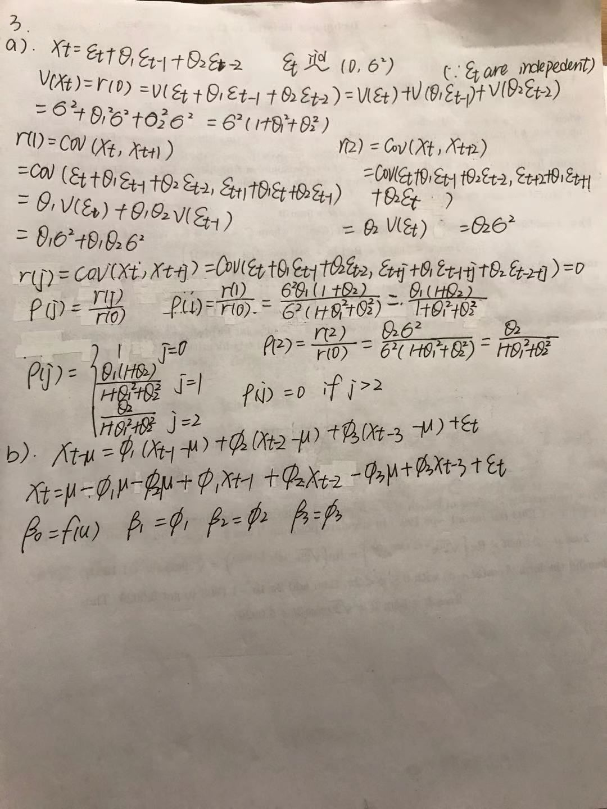

```{r setup, include=FALSE}
knitr::opts_chunk$set(echo = TRUE)
```

## R Markdown
1a
```{r}
UScrudeoil_prod <- read.csv("C:/Users/Administrator/Desktop/sta137/UScrudeoil_prod.csv")
y<-UScrudeoil_prod$U.S..Field.Production.of.Crude.Oil..Thousand.Barrels.
tm <- 1:113
plot(tm, y, type = "l")
#Obtain teh trend estimate
trnd <- loess(y ~ tm, span = 0.2)
#fit against time
plot(tm, y, type = "l", lty = 1, xlab = "Time", ylab = "Crude oil production", main = "Crude oil production versus time")
points(tm, trnd$fitted,type = "l", lty = 2, col = "blue") 
legend("topleft", "loess", lty = 2, col = "blue")
# X^hat against time
rough = trnd$residuals
plot(rough, type = "l", xlab = "Time", ylab = "Residuals", main = "Rough part")
# calculate R-square
sse <- sum((trnd$residuals)^2)
ssto <- sum((y-mean(y))^2)
R2 <- 1-sse/ssto
R2
```
b)
#Would you work with original data or would you prefer to work with the logarithm of the data?
We prefer to work with the logarithm of the data because it has a higher R square. 
```{r}
lny <- log(y) 
trndln <- loess(lny ~ tm, span = 0.2)
plot(tm, lny, type = "l", lty = 1, xlab = "Time", ylab = "Log crude oil production", main = "Log rude oil production versus time") 
points(tm, trndln$fitted,type = "l", lty = 2, col = "blue") 
legend("topleft", "loess", lty = 2, col = "blue")
plot(trndln$residuals, type = "l", xlab = "Time", ylab = "Residuals", main = "Rough part")
sse1 <- sum((trndln$residuals)^2) 
ssto1 <- sum((lny-mean(lny))^2) 
R2ln <- 1-sse1/ssto1 
R2ln #higher R square
```

c)
#Do these graphs indicate any serious departure from the normality assumption?
Histogram of rough part is reasonably symmetric about zero.Points located closer to the line so the normal probability plot seems reasonably linear.
```{r}
roughln = trndln$residuals 
#Obtain a histogram of the rought {X^t}
hist(roughln, main = "Histogram of rough part", xlab = "Rough part")
#Obtain the normal probability plot of {X^t}
qqnorm(roughln, main = "Normal probability plot of Rough") 
qqline(roughln)
```
d)
#Obtain the ACF plot (for fX t g) upto order 10 along with the +-1.96/sqrt(n) on the graph. Summarize your findings.
Looking in the graph, we can see that most line are between -1.96/sqrt(n) and +1.96/sqrt(n) except lag0. Lag0=1ACF.
```{r}
acf(roughln, lag.max = 10, main = "ACF plot of rough part")
```

e)
Ho: p(1) = ... = p(h) = 0 
Ha: at least one of p(1),..., p(h) is nonzero.
the value of the test statistics:X^2=22.529
p-value:0.01263
Conclusion: we can rejrct Ho because of very small p-value.
```{r}
library(stats) 
test <- Box.test(roughln, lag = 10, type = "Ljung-Box") 
test
```

2a
```{r}
#simulate data

x1 <- arima.sim(list(order=c(1,0,0),ar=0.8), n=100, sd=1) 
x2 <- arima.sim(list(order=c(1,0,0),ar=-0.8), n=100, sd=1) 
j <- 0:6 
ar1p <- 0.8^j 
ar1n <- (-0.8)^j

par(mfrow=c(2,2)) 
acf(x1, lag.max = 6, main = "Simulated: phi = 0.8") 
plot(j, ar1p, type = "h", main = "Theoretical: phi = 0.8", ylab = "correlation") 
abline(h=0)
acf(x2, lag.max = 6, main = "Simulated: phi = -0.8") 
plot(j, ar1n, type = "h", main = "Theoretical: phi = -0.8", ylab = "correlation") 
abline(h=0)
```

b)
```{r}
# simulate data 
y1 <- arima.sim(list(order=c(0,0,1),ma=0.7), n=100, sd=1) 
y2 <- arima.sim(list(order=c(0,0,1),ma=-0.7), n=100, sd=1) 
mr1p <- rep(0,7) 
mr1n <- rep(0,7)
mr1p[1] <- 1 
mr1n[1] <- 1 
mr1p[2] <- 0.7/(1+0.7^2) 
mr1n[2] <- -0.7/(1+0.7^2)
acf(y1, lag.max = 6, main = "Simulated: phi = 0.7") 
plot(j, mr1p, type = "h", main = "Theoretical: theta = 0.7", ylab = "correlation") 
abline(h=0) 
acf(y2, lag.max = 6, main = "Simulated: phi = -0.7") 
plot(j, mr1n, type = "h", main = "Theoretical: theta = -0.7", ylab = "correlation") 
abline(h=0)
```


3a&b

