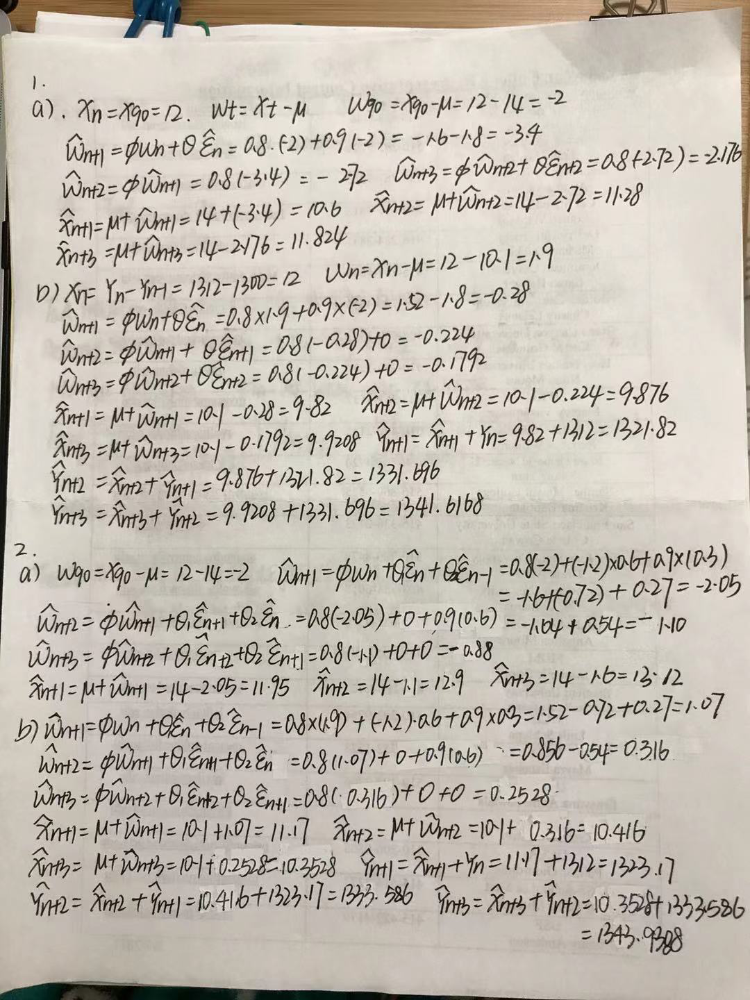

```{r setup, include=FALSE}
knitr::opts_chunk$set(echo = TRUE)
```

## R Markdown



3a
Shape of plots: Skewed Right
```{r}
r<- ARMAacf(ar = c(0.6, 0.3), lag.max = 30, pacf = F) 
l <- 0:30 
{plot(l,r,type = "p", main = "ACF of AR(2) phi1=0.6, phi2=0.3", ylab = "ACF",xlab = "Lag") 
segments(x0=l, y0=0, x1=l, y1=r) 
abline(h=0)}
r<- ARMAacf(ar = c(0.6, 0.3), lag.max = 30, pacf = T) 
l <- 1:30 
{plot(l,r,type = "p", main = "ACF of AR(2) phi1=0.6, phi2=0.3", ylab = "PACF",xlab = "Lag") 
segments(x0=l, y0=0, x1=l, y1=r) 
abline(h=0)}

```
3b
Shape of plots: Skewed Right
```{r}
r<- ARMAacf(ar = c(-0.6, 0.3), lag.max = 30, pacf = F)
l <- 0:30
{plot(l,r,type = "p", main = "ACF of AR(2) phi1=-0.6, phi2=0.3", ylab = "ACF",xlab = "Lag") 
segments(x0=l, y0=0, x1=l, y1=r) 
abline(h=0)}
r<- ARMAacf(ar = c(-0.6, 0.3), lag.max = 30, pacf = T) 
l <- 1:30 
{plot(l,r,type = "p", main = "ACF of AR(2) phi1=-0.6, phi2=0.3", ylab = "PACF",xlab = "Lag") 
segments(x0=l, y0=0, x1=l, y1=r) 
abline(h=0)}
```
3c
Shape of plots: Skewed Right
```{r}
r<- ARMAacf(ar = c(1.4, -0.7), lag.max = 30, pacf = F) 
l <- 0:30 
{plot(l,r,type = "p", main = "ACF of AR(2) phi1=1.4, phi2=-0.7", ylab = "ACF",xlab = "Lag") 
segments(x0=l, y0=0, x1=l, y1=r) 
abline(h=0)}
r <- ARMAacf(ar = c(1.4, -0.7), lag.max = 30, pacf = T)
l <- 1:30 
{plot(l,r,type = "p", main = "PACF of AR(2) phi1=1.4, phi2=-0.7", ylab = "PACF",xlab = "Lag") 
segments(x0=l, y0=0, x1=l, y1=r) 
abline(h=0)}
```
3d
Shape of plots: Skewed Right
```{r}
r<- ARMAacf(ar = c(-1.4, -0.7), lag.max = 30, pacf = F) 
l <- 0:30 
{plot(l,r,type = "p", main = "ACF of AR(2) phi1=-1.4, phi2=-0.7", ylab = "ACF",xlab = "Lag") 
segments(x0=l, y0=0, x1=l, y1=r) 
abline(h=0)}
r<- ARMAacf(ar = c(-1.4, -0.7), lag.max = 30, pacf = T) 
l <- 1:30 
{plot(l,r,type = "p", main = "ACF of AR(2) phi1=-1.4, phi2=-0.7", ylab = "PACF",xlab = "Lag") 
segments(x0=l, y0=0, x1=l, y1=r) 
abline(h=0)}
```

3e
Shape of plots: Skewed Right
```{r}
r<- ARMAacf(ar = c(-1.4, -0.7), ma=c(-1.1,0.3),lag.max = 30, pacf = F) 
l <- 0:30 
{plot(l,r,type = "p", main = "ACF of ARMA(2,2) phi1=-1.4, phi2=-0.7,theta1=-1.1,theta2=0.3", ylab = "ACF",xlab = "Lag") 
segments(x0=l, y0=0, x1=l, y1=r) 
abline(h=0)}
r<- ARMAacf(ar = c(-1.4, -0.7), ma=c(-1.1,0.3),lag.max = 30, pacf = T) 
l <- 1:30 
{plot(l,r,type = "p", main = "ACF of ARMA(2,2) phi1=-1.4, phi2=-0.7,theta1=-1.1,theta2=0.3", ylab = "PACF",xlab = "Lag") 
segments(x0=l, y0=0, x1=l, y1=r) 
abline(h=0)}
```

4a
finding: The overall series is increasing. All values of lag are outside of 0. Only lag1 are outside of 0 and others are inside of PACF. 
```{r}
x <- read.csv("C:/Users/Administrator/Desktop/sta137/GlobTempNASA_2020.csv"，header=TRUE)
x <- x[,2]
y<-diff(x,1)
#Plot the series against time.
plot.ts(x)
plot.ts(y)
#plot ACF
acf(y)
#plot PACF
pacf(y)
```
4b
ARIMA(3,1,2) has the smallest aicc so it is the most appropriate model.The residuals from this model can be described as white noise because base on the ACF plot most ACF of lag are inside 0 except lag0 and lag9. 
```{r}
library(astsa) 
AICc<-matrix(0,4,4) 
for (i in 1:4){
    for (j in 1:4){
       AICc[i,j]<-sarima(x,p=i-1,d=1,q=j-1,details=FALSE)$AICc
  } 
} 
AICc
sarima(x,p=3,d=1,q=2,details=FALSE)
model<-arima(x,order=c(3,1,2)) 
acf(model$residuals)
```

4c
We can see that the fitted model line is close fitted to the true model line, so i think this is a good fit  
```{r}
library(forecast)
model <- auto.arima(x, stepwise=F, approximation=F, ic="aicc")
model
n <- length(x) 
plot.ts(x) 
lines(1:n, model$fitted, col = "blue") 
legend("top", legend = c("true","fitted"), lty=c(1, 1), col = c("black","blue"))
```
4d
We use 95% confidence Interval to predict the value,but the trend should go upward,therefore it should be a quality prediction.
```{r}
#split data 
xnew <- x[1:(n-5)] 
xlast <- x[(n-4):n]
#fit 
model1 <- arima(xnew,order = c(3,1,2)) 
#prediction 
h <- 5 
m <- n - h 
fcast <- predict(model1, n.ahead=h)
fcast
upper <- fcast$pred+1.96*fcast$se 
upper
lower <- fcast$pred-1.96*fcast$se 
lower
#plot 
plot.ts(xnew, xlim = c(0,n), xlab = "x") 
polygon(x=c(m+1:h,m+h:1), y=c(upper,rev(lower)), col='lightblue', border=NA) 
lines(x=m+(1:h), y=fcast$pred,col='blue') 
lines(x=m+(1:h), y=xlast,col='black')
legend("top", legend = c("true","fitted"), lty=c(1, 1), col = c("black","blue"))
```
```{r ref.label=knitr::all_labels(), echo=TRUE, eval=FALSE}
```

